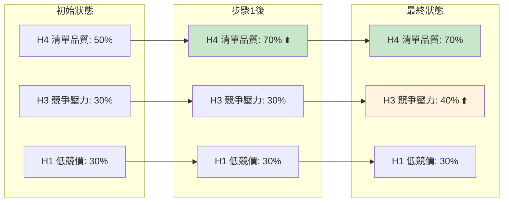
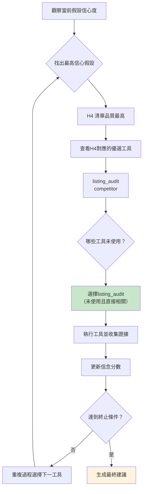

# AI 代理思考過程可視化

## 代理決策流程圖

```mermaid
flowchart TD
    A[🎯 目標：改善轉化率<br/>ASIN: B0MOCKHCLC] --> B[🧠 初始假設設定]
    
    B --> B1[H4 清單品質: 50%<br/>H3 競爭壓力: 30%<br/>H1 低競價: 30%]
    
    B1 --> C[🔍 步驟1: 觀察情境]
    
    C --> D{🤔 思考：哪個假設<br/>需要最多資訊？}
    
    D --> D1[選擇H4清單品質<br/>信心度最高: 50%]
    
    D1 --> E[⚡ 決策：選擇listing_audit工具<br/>原因：直接檢測清單品質問題]
    
    E --> F[🛠️ 執行listing_audit]
    
    F --> F1[📊 發現：<br/>• 標題關鍵字覆蓋不足<br/>• 主圖質量有待改善<br/>• A+內容存在<br/>• 產品評分良好]
    
    F1 --> G[🔄 更新信念：<br/>H4 清單品質: 50% → 70%]
    
    G --> H[🔍 步驟2: 重新觀察]
    
    H --> I{🤔 思考：需要更多<br/>競爭環境資訊？}
    
    I --> I1[H4仍是最高信心<br/>但需了解競爭情況]
    
    I1 --> J[⚡ 決策：選擇competitor工具<br/>原因：了解市場競爭對清單品質的影響]
    
    J --> K[🛠️ 執行competitor分析]
    
    K --> K1[📊 發現：<br/>• 競爭對手平均價格<br/>• 贊助廣告佔有率<br/>• 頂級競爭對手評分]
    
    K1 --> L[🔄 更新信念：<br/>H3 競爭壓力: 30% → 40%<br/>H4 清單品質: 維持70%]
    
    L --> M{🎯 終止條件檢查}
    
    M --> M1[✅ H4達到70%信心<br/>✅ 相關工具已執行<br/>✅ 超過最小探索步驟]
    
    M1 --> N[🏁 最終結論：<br/>H4清單品質問題最可能<br/>信心度：70%]
    
    N --> O[💡 行動建議：<br/>• 優化產品標題關鍵字<br/>• 改善主產品圖片<br/>• 增強產品描述]
    
    style A fill:#e1f5fe
    style N fill:#c8e6c9
    style O fill:#fff3e0
    style D fill:#f3e5f5
    style I fill:#f3e5f5
    style M fill:#ffebee
```

## 信念演化圖表

## 工具選擇邏輯

## 關鍵設計原則

### 1. 觀察-思考-行動循環
- **觀察**：收集當前情境和數據
- **思考**：更新假設信心度
- **決策**：選擇最有資訊價值的工具
- **行動**：執行工具並整合結果

### 2. 動態工具選擇
- 不是固定順序，而是基於當前信念狀態
- 優先選擇能提供最多資訊增益的工具
- 避免重複使用相同工具

### 3. 證據驅動的信念更新
- 強證據：+0.2 信心度
- 中等證據：+0.1 信心度  
- 弱證據：+0.05 信心度
- 反證據：-0.1 信心度

### 4. 智能終止機制
- 極高信心（≥80%）立即終止
- 高信心（≥70%）+ 工具完成終止
- 最少3步探索保證
- 最多5步防止無限循環