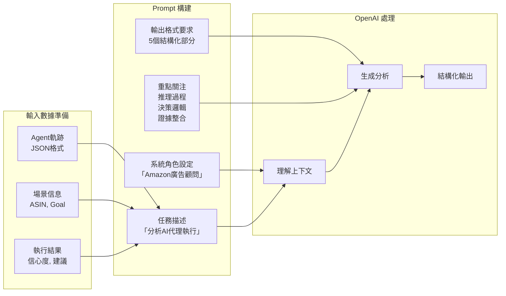
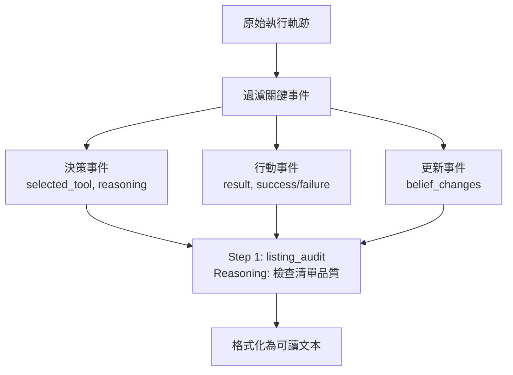
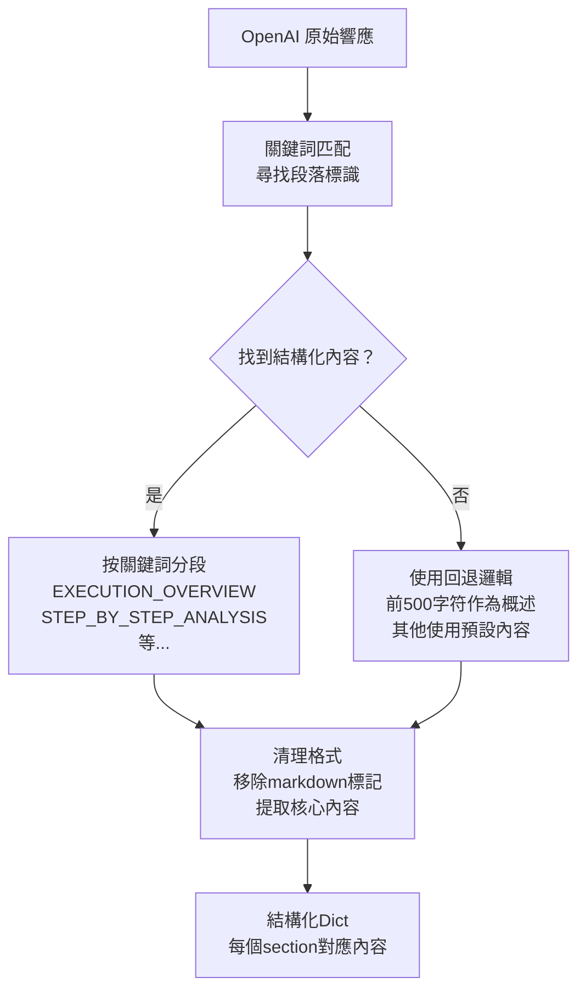

# OpenAI 報告生成思考過程可視化

## OpenAI 分析 Agent 執行軌跡的完整流程

```mermaid
flowchart TD
    A[📊 Agent 執行完成<br/>生成執行軌跡] --> B[📋 準備分析上下文]
    
    B --> B1[🔍 提取步驟詳情<br/>• 工具選擇<br/>• 推理過程<br/>• 執行結果<br/>• 信念更新]
    
    B1 --> B2[📝 格式化執行步驟<br/>Step 1: listing_audit ✅<br/>- Reasoning: 檢查清單品質<br/>- Findings: 標題關鍵字、圖片質量<br/>- Belief Updates: H4: 0.50 → 0.70]
    
    B2 --> C[🤖 發送到 OpenAI GPT-3.5]
    
    C --> C1[📋 System Prompt:<br/>「你是Amazon廣告顧問<br/>用簡單商業術語解釋複雜數據」]
    
    C1 --> C2[📝 User Prompt:<br/>「分析這個AI代理的執行過程<br/>解釋其推理步驟和發現」]
    
    C2 --> D[🧠 OpenAI 思考過程]
    
    subgraph "OpenAI 內部分析"
        D --> D1[🔍 分析執行概述<br/>「代理採用系統性方法<br/>從清單審計開始」]
        
        D1 --> D2[📝 逐步分析<br/>「Step 1: 選擇listing_audit<br/>因為轉化率問題通常<br/>與清單品質相關」]
        
        D2 --> D3[📈 推理演化分析<br/>「代理信心從50%增至70%<br/>基於清單審計發現的證據」]
        
        D3 --> D4[💡 關鍵發現識別<br/>「標題關鍵字覆蓋不足<br/>主圖品質待改善」]
        
        D4 --> D5[🔬 過程評估<br/>「展示了邏輯性決策流程<br/>基於證據更新信念」]
    end
    
    D5 --> E[📤 OpenAI 響應返回]
    
    E --> F[🔧 解析 AI 響應]
    
    F --> F1[🔍 識別關鍵段落<br/>• EXECUTION_OVERVIEW<br/>• STEP_BY_STEP_ANALYSIS<br/>• REASONING_EVOLUTION<br/>• DISCOVERY_INSIGHTS<br/>• PROCESS_EVALUATION]
    
    F1 --> F2[📋 結構化內容<br/>將AI回應分解為<br/>預定義的sections]
    
    F2 --> G[📊 創建增強報告]
    
    G --> G1[🎨 生成ASCII圖表<br/>Listing Quality      │■■■■■■■□□□│ 70%<br/>Competitor Pressure  │■■■■□□□□□□│ 40%]
    
    G1 --> G2[📝 組裝Markdown報告<br/>• 執行概述<br/>• 步驟分析<br/>• 推理演化<br/>• 關鍵發現<br/>• 過程評估]
    
    G2 --> H[💾 保存報告文件<br/>analysis_B0MOCKHCLC_20250912_220514.md]
    
    style A fill:#e3f2fd
    style C fill:#f3e5f5
    style D fill:#fff3e0
    style E fill:#e8f5e8
    style H fill:#fce4ec
```



## OpenAI Prompt 工程詳解



## 關鍵處理步驟詳解

### 1. 📊 執行軌跡提取



### 2. 🤖 OpenAI 分析邏輯

OpenAI接收格式化的執行步驟，並進行以下分析：

| 分析維度 | OpenAI 關注點 | 輸出內容 |
|---------|--------------|----------|
| **執行概述** | 整體方法論和策略 | "代理採用系統性方法，從清單審計開始..." |
| **步驟分析** | 每步的決策邏輯 | "Step 1選擇listing_audit因為轉化率問題通常與清單品質相關" |
| **推理演化** | 信念如何變化 | "代理信心從50%增至70%，基於清單審計的證據" |
| **關鍵發現** | 重要洞察識別 | "發現標題關鍵字覆蓋不足，主圖品質待改善" |
| **過程評估** | 決策品質評價 | "展示了邏輯性決策流程和基於證據的信念更新" |

### 3. 📝 響應解析與結構化



### 4. 📊 報告生成流程


## 實際示例：OpenAI 思考過程

### 輸入給 OpenAI 的Prompt：

```
Amazon Advertising Agent Execution Analysis:

ASIN: B0MOCKHCLC  
Goal: improve_conversion

DETAILED EXECUTION STEPS:
Step 1: listing_audit ✅ Success
- Reasoning: Auditing listing quality related to h4_listing_quality (belief: 0.50)
- Findings: title keywords coverage, main image score, A+ content presence, product rating
- Belief Updates:
  * h4_listing_quality: 0.50 → 0.70 ↗️

Step 2: competitor ✅ Success  
- Reasoning: Checking competitive landscape for h4_listing_quality (belief: 0.70)
- Findings: competitive pressure, price positioning, top competitor rating
- Belief Updates:
  * h3_competitor_pressure: 0.30 → 0.40 ↗️
```

### OpenAI 的分析思考：

1. **模式識別**: "這是一個轉化率優化任務，代理從清單品質開始分析"
2. **邏輯推理**: "Step 1選擇listing_audit是明智的，因為轉化問題通常源於產品展示"
3. **證據評估**: "清單審計將信心度從50%提升到70%，表明發現了重要問題"
4. **策略理解**: "Step 2分析競爭對手是為了獲得清單優化的對比基準"
5. **結論形成**: "代理展示了系統性的診斷方法和基於證據的決策"

這個流程展示了OpenAI如何將原始的技術執行軌跡轉化為人類可理解的商業洞察和分析報告。