# B0MOCKHAC 分析報告可視化

## Agent 決策流程圖


## 假設信心度演化

```mermaid
xychart-beta
    title "假設信心度變化過程"
    x-axis [初始, 步驟1後, 步驟2後, 步驟3後, 步驟4後]
    y-axis "信心度 (%)" 0 --> 50
    
    line [30, 35, 40, 42, 45]
    line [40, 40, 38, 38, 40]
    line [30, 30, 32, 32, 35]
```

## 工具使用順序與邏輯

```mermaid
graph LR
    subgraph "工具執行順序"
        A1[ads_metrics<br/>分析廣告數據] --> A2[listing_audit<br/>審計清單品質]
        A2 --> A3[competitor<br/>競爭環境分析]
        A3 --> A4[inventory<br/>庫存狀態檢查]
    end
    
    subgraph "選擇邏輯"
        B1[H5 廣泛匹配浪費<br/>信心度最高 40%] --> A1
        B2[H4 清單品質<br/>被步驟1更新] --> A2
        B3[理解競爭對<br/>清單品質的影響] --> A3
        B4[驗證庫存對<br/>清單品質的影響] --> A4
    end
    
    style A1 fill:#e3f2fd
    style A2 fill:#f3e5f5
    style A3 fill:#e8f5e8
    style A4 fill:#fff3e0
```



## 最終假設排名圖表


## 關鍵發現時間線


## 建議行動優先級


## Agent 決策品質評估

```mermaid
radar
    title Agent 決策品質評分
    date-format X
    axisFormat %d
    
    系統性方法 : [85]
    證據整合 : [75]
    適應能力 : [80]
    工具選擇 : [70]
    結論合理性 : [75]
```

## 總結

這個 5 步驟的分析過程展示了 AI Agent 如何：

1. **從最可疑的假設開始** - 廣泛匹配浪費（40% 信心度）
2. **動態調整重點** - 基於 ads_metrics 發現轉向清單品質
3. **系統性收集證據** - 通過多個工具驗證假設
4. **整合多維度信息** - 廣告數據 + 清單品質 + 競爭環境 + 庫存狀態
5. **得出可行結論** - 清單品質問題是降低 ACOS 的關鍵

最終 45% 的信心度反映了問題的複雜性，需要多方面優化才能有效降低 ACOS。